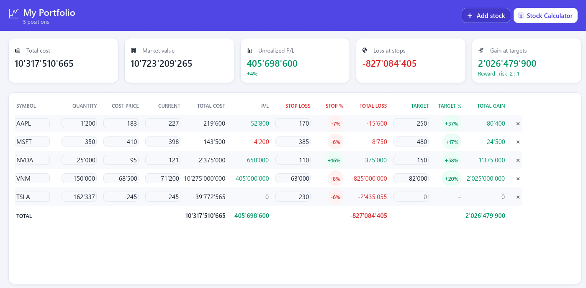
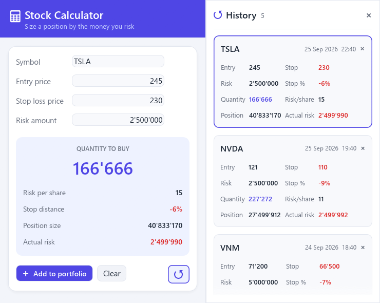

# Stock Calc

A small Windows desktop toolkit for managing a stock portfolio and sizing new
positions by risk, written in Rust with [egui](https://github.com/emilk/egui).

It ships as two programs that work together:

| Program | What it does |
| --- | --- |
| `portfolio.exe` | Track your positions, stop losses and targets |
| `stockcalc.exe` | Calculate how many shares to buy for a given risk |



## Portfolio

- One row per stock: symbol, quantity, cost price, current price, stop loss
  and target, all editable in place.
- Calculated columns: total cost, unrealized P/L, stop % and total loss if
  the stop is hit, target % and total gain if the target is reached.
- Summary cards for total cost, market value, unrealized P/L, loss at stops,
  gain at targets and the overall reward : risk ratio.
- **Stock Calculator** opens the calculator (or brings it to the front).

## Stock Calculator



Enter a symbol, entry price, stop loss price and the amount of money you are
willing to lose. The calculator shows:

- **Quantity to buy** = risk amount ÷ (entry − stop), rounded down so a
  stop-out never loses more than the risk amount
- risk per share, stop distance %, position size and actual risk

**Add to portfolio** appends the position to the portfolio (entry becomes the
cost price) and brings the portfolio window to the front if it's open.
**Portfolio** opens the portfolio app.

The **↺** button opens a history panel with one entry per calculated symbol,
newest first. Click an entry to load it back into the calculator, or **✖** to
remove it.

## Conventions

- All numbers are whole numbers with `'` as the thousand separator
  (`1'234'567`), including while you type. Separators are inserted
  automatically; pasted decimals are rounded.
- Everything is saved automatically as you type and loaded on start.
- Each program runs as a single instance: launching it again just brings the
  open window to the front.

## Data

Data is stored as JSON in `%APPDATA%\StockCalc`:

| File | Contents |
| --- | --- |
| `portfolio.json` | Portfolio positions |
| `stockcalc.json` | Last calculator inputs and the calculation history |

Set the `STOCK_CALC_DIR` environment variable to use a different folder (handy
for testing). If a file can't be read, it is copied to `*.json.bak` before
anything is overwritten.

## Building

Requires a recent stable Rust toolchain (edition 2024) on Windows.

```bash
cargo build --release
```

Both executables are written to `target/release/`. Keep `portfolio.exe` and
`stockcalc.exe` in the same folder so each can launch the other. The app icon
(`stock_calc.ico`) is embedded at build time.

Run the unit tests with:

```bash
cargo test
```

## Project layout

```
build.rs              embeds the Windows icon
src/
  lib.rs
  format.rs           ' separator formatting and the live-formatting input
  model.rs            data types, position sizing, history, persistence
  theme.rs            colors, fonts, shared widgets, app icon
  instance.rs         single instance + switching between the two apps
  bin/portfolio.rs    portfolio.exe
  bin/stockcalc.rs    stockcalc.exe
```
