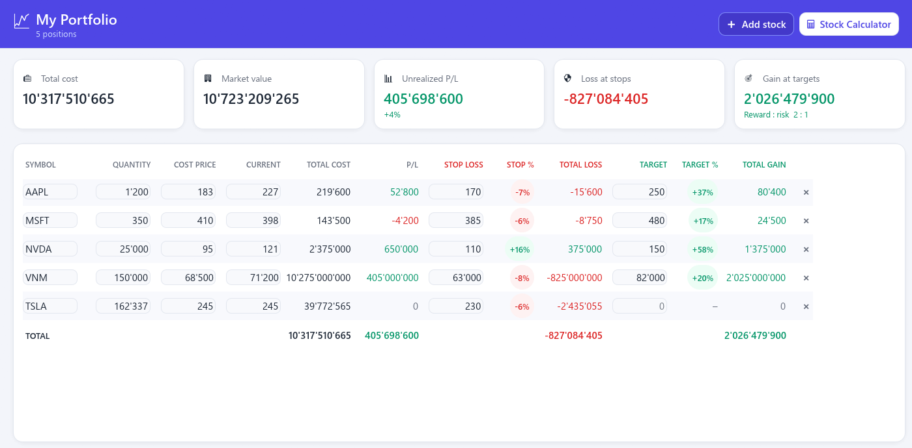
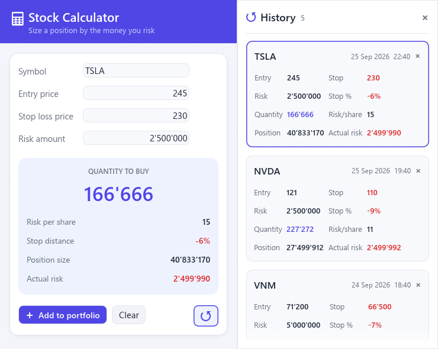

# Stock Calc

A small Windows desktop toolkit for managing a stock portfolio and sizing new
positions by risk, written in Rust with [egui](https://github.com/emilk/egui).

It ships as two programs that work together:

| Program | What it does |
| --- | --- |
| `portfolio.exe` | Track your positions, stop losses and targets |
| `stockcalc.exe` | Calculate how many shares to buy for a given risk |



## Portfolio

- One row per stock: symbol, quantity, cost price, current price, stop loss
  and target, all editable in place.
- Calculated columns: total cost, unrealized P/L with its percentage, stop %
  and total loss if the stop is hit, target % and total gain if the target is
  reached.
- Symbols are colored by unrealized P/L: red for a loss, green for a gain.
- The table sorts by symbol (default), total cost, P/L or P/L % — click the
  column header to change the sort, click again to flip the direction. A
  small pin before a symbol name pins the row to the top; pinned rows keep
  the chosen sort among themselves, and pins are saved with the portfolio.
- The P/L % column doubles as a horizontal bar chart: a bar starts at the
  left edge of the cell, its length proportional to the P/L % relative to
  the table's biggest, red for a loss and green for a gain.
- The Total Cost column does the same in light blue: bar length is this
  row's total cost relative to the largest position in the table.
- The P/L column does the same for the money amount: bar length is this
  row's unrealized P/L relative to the biggest move in the table, green
  for a gain and red for a loss.
- The stop loss cell's background blinks orange when the current price comes
  within 0.5% of it, and blinks red faster once it drops below it.
- Summary cards for total cost, market value, unrealized P/L, loss at stops,
  gain at targets and the overall reward : risk ratio.
- **Import** reads positions from a broker's portfolio export: click it to
  pick the broker (currently SSI) and then its file. Only symbol, quantity,
  average cost and market price are taken — every calculated field stays
  computed by the app, and stop loss / target start empty. Adding merges
  rows whose symbol already exists instead of duplicating them: quantities
  add up and the cost price becomes the weighted average of the old and
  imported lots (stop loss and target are kept).
- **Stock Calculator** opens the calculator (or brings it to the front).

## Live prices

The portfolio keeps the current-price column up to date for Vietnamese stocks
(HOSE, HNX, UPCOM) using [Yahoo Finance](https://finance.yahoo.com/) — a free
source that needs no API key. On start up, and every 10 seconds after that
until the window is closed, the app fetches the last traded price of every
symbol in the table (sent to Yahoo with a `.VN` suffix) on a background
thread, updates the column and saves the result. Stocks that Yahoo doesn't
know keep their last saved price; network failures are silent and never
overwrite anything. The status bar shows when prices were last updated —
Yahoo's quotes for Vietnamese markets are delayed by about 15–20 minutes.

## Stock Calculator



Enter a symbol, entry price, stop loss price and the amount of money you are
willing to lose. The calculator shows:

- **Quantity to buy** = risk amount ÷ (entry − stop), rounded down so a
  stop-out never loses more than the risk amount
- risk per share, stop distance %, position size and actual risk

**Add to portfolio** appends the position to the portfolio (entry becomes the
cost price) and brings the portfolio window to the front if it's open.
**Portfolio** opens the portfolio app.

The **↺** button opens a history panel with one entry per calculated symbol,
newest first. Click an entry to load it back into the calculator, or **✖** to
remove it.

## Conventions

- All numbers are whole numbers with ',' as the thousand separator
  (1,234,567), including while you type. Separators are inserted
  automatically; pasted decimals are rounded. '.' is the decimal point.
- Percentages show two digits after the decimal point (e.g. -13.88%).
- Everything is saved automatically as you type and loaded on start.
- Each program runs as a single instance: launching it again just brings the
  open window to the front.

## Data

Data is stored as JSON in `%APPDATA%\StockCalc`:

| File | Contents |
| --- | --- |
| `portfolio.json` | Portfolio positions |
| `stockcalc.json` | Last calculator inputs and the calculation history |

Set the `STOCK_CALC_DIR` environment variable to use a different folder (handy
for testing). If a file can't be read, it is copied to `*.json.bak` before
anything is overwritten.

## Building

Requires a recent stable Rust toolchain (edition 2024) on Windows.

```bash
cargo build --release
```

Both executables are written to `target/release/`. Keep `portfolio.exe` and
`stockcalc.exe` in the same folder so each can launch the other. The app icon
(`stock_calc.ico`) is embedded at build time.

The Visual C++ runtime is linked statically (see `.cargo/config.toml`), so the
two executables run on Windows 10/11 as-is: no installer and no VC++
Redistributable needed. Just copy them anywhere and run.

Run the unit tests with:

```bash
cargo test
```

## Project layout

```
build.rs              embeds the Windows icon
src/
  lib.rs
  format.rs           ' separator formatting and the live-formatting input
  model.rs            data types, position sizing, history, persistence
  quotes.rs           live prices for Vietnamese stocks from Yahoo Finance
  theme.rs            colors, fonts, shared widgets, app icon
  instance.rs         single instance + switching between the two apps
  bin/portfolio.rs    portfolio.exe
  bin/stockcalc.rs    stockcalc.exe
```
